# DUM-E형 AR 기반 범용 정밀작업 공유자율 로봇 시스템

> **프로젝트 한 줄 정의**  
> 작업자가 손·머리 제스처와 음성으로 의도를 전달하면, M0609가 전면·측면·손목 카메라로 작업공간과 움직이는 물체를 3D로 인식하고, 안전한 미래 경로를 AR로 실시간 제안한 뒤 사용자의 승인을 받아 파지·운반·삽입·뚜껑 체결 등의 정밀 작업을 수행하며, 작업 로그와 실패 원인을 기억해 다음 행동을 먼저 추천하는 DUM-E형 범용 로봇 시스템

---

## 1. 프로젝트 배경

영화 속 DUM-E처럼 사람의 옆에서 지시를 이해하고 다양한 작업을 보조하는 로봇을 만들고자 한다.  
단순히 정해진 좌표를 반복하는 산업용 로봇이 아니라, 작업자의 제스처·음성·작업 습관을 이해하고 변화하는 환경에서 유연하게 행동하는 **범용 정밀작업 보조 로봇**이 목표다.

실험실·연구실·공방·조립 작업대에서는 다음과 같은 비정형 상황이 자주 발생한다.

- 작업 대상과 목적지의 위치가 매번 달라짐
- 작업 중 사람이나 물체가 이동하여 기존 경로가 막힘
- 정해진 Pick & Place뿐 아니라 삽입, 누르기, 회전, 뚜껑 체결과 같은 정밀 작업이 필요함
- 로봇 좌표와 관절값을 모르는 사용자도 빠르게 작업을 지시해야 함
- 처음 수행하는 작업은 사람이 직접 가르치고, 반복 작업은 로봇이 기억하여 점차 자동화할 필요가 있음
- 실패했을 때 단순 정지가 아니라 원인을 설명하고 적절한 복구 행동을 제안할 필요가 있음

본 시스템은 **사람의 판단과 공간적 의도**를 **로봇의 정밀 제어·3D 인식·충돌 회피 능력**과 결합한다.

> **사람은 무엇을 하고 싶은지 전달하고, 로봇은 어떻게 안전하고 정확하게 수행할지 계산한다.**

---

## 2. 프로젝트 목표

### 2.1 핵심 목표

1. 웹캠으로 작업자의 손과 머리를 인식하여 M0609의 TCP 위치·자세를 직관적으로 제어
2. 손 제스처를 이용해 이동, 회전, 그리퍼, 대상 선택, 장애물 지정, 목표 위치 설정 등의 모드 전환
3. 태스크 카메라 화면에 가상 손, 현재 TCP, 목표점, 작업 모드, 장애물, 후보 경로를 AR로 표현
4. 전면 카메라·측면 카메라·손목 D455를 융합하여 물체와 움직이는 장애물의 3D 위치를 추정
5. 사용자가 지정한 물체를 고정 장애물 또는 동적 장애물로 등록하고 지속적으로 추적
6. MoveIt 2 기반 전역 경로계획과 RMPflow 기반 실시간 지역 회피를 결합
7. 움직이는 장애물과 목표물의 미래 위치를 예측하여 경로를 지속적으로 갱신
8. 추천 경로와 대체 경로를 AR로 미리 보여주고 음성 또는 제스처로 승인 후 실행
9. 물체 파지, 이동 중 회피, 움직이는 통에 삽입, 움직이는 대상의 뚜껑 체결과 같은 정밀 작업 수행
10. MoveJ, MoveL, Servo, Visual Servo, 순응제어를 태스크 단계에 맞게 조합
11. 파지·운반·삽입·체결 실패 원인을 역추적하고 복구 행동을 제안
12. 과거 작업 로그를 기억하여 현재 상황에서 다음 행동 후보와 성공 확률을 제시

---

## 3. 최종 데모 태스크

## 3.1 태스크 명칭

### 움직이는 환경에서의 물체 회수·동적 장애물 회피·정밀 삽입 및 체결 작업

본 프로젝트는 특정 물질이나 단일 공정에 한정되지 않는다.  
대표 데모에서는 로봇이 물체를 집고, 움직이는 장애물을 피하며, 이동하는 목적지에 물체를 넣거나 뚜껑을 체결한다.

### 데모 A — 움직이는 통에 물체 삽입

1. 작업자가 제스처로 대상 물체를 선택
2. 전면·측면 카메라로 장애물과 움직이는 통을 3D 추적
3. 로봇이 후보 경로를 계산하여 AR로 표시
4. 작업자가 음성으로 경로 승인
5. 로봇이 물체를 파지
6. 움직이는 장애물을 실시간 회피
7. 이동하는 통의 미래 위치를 예측
8. Visual Servo와 순응제어로 물체를 통 안에 삽입
9. 성공 여부와 작업 로그 저장

### 데모 B — 움직이는 대상의 뚜껑 체결

1. 뚜껑과 대상 용기의 위치·속도를 추적
2. 로봇이 대상과 속도를 맞추며 접근
3. 그리퍼와 용기 중심을 정렬
4. 낮은 Z축 강성으로 접촉 유지
5. 손목 회전 또는 J6 회전으로 뚜껑 체결
6. 체결 토크·회전량·Z 변위로 완료 판단
7. 실패 시 풀기·재정렬·재체결 제안

> 초기 MVP에서는 **저속으로 이동하는 통에 물체를 삽입하는 태스크**를 우선 구현하고, 뚜껑 체결은 고급 태스크로 확장한다.

---

## 3.2 작업대 구성

| 구성 요소 | 역할 |
|---|---|
| Doosan M0609 | 정밀 조작 및 작업 수행 |
| RG2 또는 장착 그리퍼 | 물체·뚜껑 파지 |
| 일반 작업 물체 | Pick 대상 |
| 이동 통 또는 이동 트레이 | 동적 Place·삽입 목표 |
| 정적 장애물 | 기본 충돌 회피 검증 |
| 이동 장애물 | 실시간 추적·경로 변형 검증 |
| 전면 태스크 카메라 | 작업공간 정면 관찰 |
| 측면 태스크 카메라 | 깊이·가림 보완 |
| 손목 D455 | 근거리 RGB-D 정밀 인식 |
| 사용자 웹캠 | 손·머리 추적 |
| 마이크·스피커 | 음성 질문·승인·상태 안내 |
| 모니터 | AR 작업 화면 |
| 이동 플랫폼 | 통·장애물을 일정 속도로 이동시키는 장치 |

---

## 3.3 전체 수행 시나리오

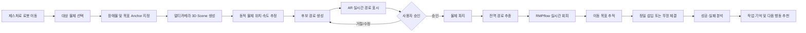

---

## 3.4 상세 작업 흐름

### STEP 1. 제스처 기반 직접 조작

작업자는 오른손의 절대 위치를 이용하여 M0609의 가상 목표 TCP를 이동시킨다.

- 손 좌우 이동 → 로봇 X/Y 이동
- 손 상하 이동 → 로봇 Z 이동
- 손과 카메라 사이 거리 → 전후 이동
- 손바닥 방향 → TCP 방향 후보
- 머리 방향 → Orientation 모드에서 TCP Yaw/Pitch
- 엄지·검지 간격 → 그리퍼 너비

태스크 카메라 화면에는 로봇 베이스 좌표 기준의 가상 손 위치가 AR 구 또는 반투명 손 형태로 표시된다.

화면 표시 예시:

- 현재 제어 모드
- 현재 TCP
- 가상 목표 TCP
- 손 추적 신뢰도
- 속도·정밀 모드
- 작업 가능 영역
- 로봇 상태와 안전 상태

---

### STEP 2. 대상·장애물·목표 위치 지정

작업자는 제스처로 화면 속 물체를 선택한다.

#### 대상 선택

```text
SELECT 모드
→ 검지로 물체를 가리킴
→ 오른손 핀치
→ 대상 물체 선택
```

#### 장애물 지정

```text
물체 선택
→ 왼손 손바닥 유지 또는 음성 “장애물로 등록해”
→ Dynamic/Static Obstacle Anchor 생성
```

#### 목표 위치 지정

```text
PLACE TARGET 모드
→ 가상 커서를 목표 위치로 이동
→ 핀치로 좌표 확정
→ 카메라 Depth 또는 바닥 평면에 Snap
```

시스템:

> “선택한 검은 블록을 동적 장애물로 추적할까요?”

작업자:

> “응. 그리고 파란 통 안에 넣을 거야.”

이때 Task Context는 다음과 같이 저장된다.

```yaml
task_type: moving_target_insertion
target_object: part_red_01
destination: moving_bin_blue_01
obstacles:
  - object_id: block_black_01
    type: dynamic
  - object_id: frame_gray_01
    type: static
constraints:
  keep_orientation: true
  approach_direction: top
  minimum_clearance: 0.08
  force_limit: 15.0
approval_required: true
```

---

### STEP 3. 전면·측면·손목 카메라 기반 3D Scene 생성

#### 전면 카메라

- 작업공간 전체와 좌우 위치 파악
- AR 오버레이의 기준 영상
- 작업 대상과 장애물의 전면 외형 추적

#### 측면 카메라

- 전면 영상에서 알기 어려운 깊이·높이 보완
- 객체 가림 상황 완화
- 움직이는 객체의 측면 속도 추정

#### 손목 D455

- 목표 근처의 RGB 및 Depth 획득
- 파지점·삽입구·뚜껑 중심의 정밀 위치 추정
- 근접 작업 중 Visual Servo 입력
- 최종 접촉 전 정렬 보정

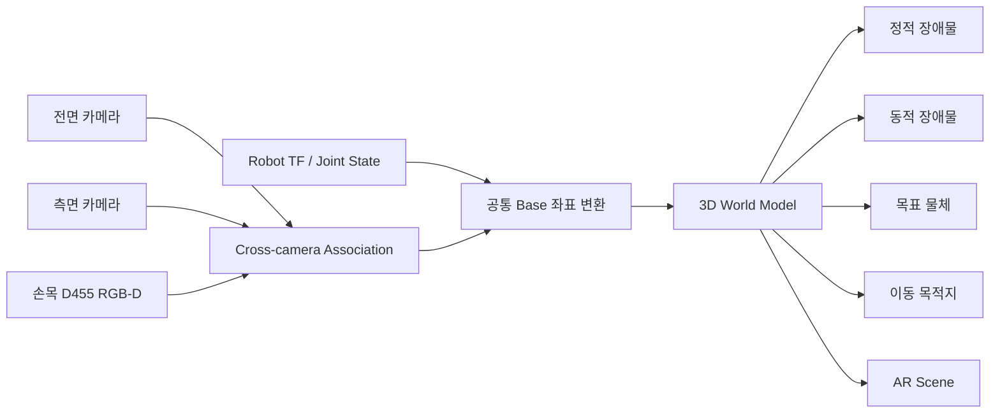

---

### STEP 4. 동적 객체 추적과 미래 위치 예측

각 객체는 로봇 베이스 좌표계에서 다음 상태로 관리한다.

\[
\mathbf{x}
=
\begin{bmatrix}
x & y & z & v_x & v_y & v_z
\end{bmatrix}^{T}
\]

카메라 관측으로 위치를 갱신하고 Kalman Filter 또는 다른 추적기를 이용해 속도와 미래 위치를 추정한다.

\[
\hat{\mathbf{p}}(t+\Delta t)
=
\mathbf{p}(t)
+
\mathbf{v}(t)\Delta t
\]

동적 객체마다 다음 정보를 관리한다.

```yaml
object_id: moving_obstacle_01
class: obstacle
position: [0.42, -0.18, 0.25]
velocity: [0.00, 0.08, 0.00]
size: [0.12, 0.10, 0.25]
confidence: 0.91
prediction_horizon: 1.5
safety_margin: 0.10
observed_by:
  - front_camera
  - side_camera
```

---

### STEP 5. 전역 후보 경로 생성과 AR 승인

목표와 장애물의 3D 위치가 결정되면 MoveIt 2와 OMPL을 이용해 복수 경로를 생성한다.

- 장애물 왼쪽 우회
- 장애물 오른쪽 우회
- 장애물 상단 우회
- 팔꿈치 자세가 다른 대체 IK 경로

경로 비용은 다음 요소를 포함한다.

\[
J =
w_d C_{\text{distance}}
+ w_t C_{\text{time}}
+ w_o C_{\text{clearance}}
+ w_j C_{\text{joint-limit}}
+ w_s C_{\text{singularity}}
+ w_m C_{\text{motion-smoothness}}
+ w_v C_{\text{dynamic-prediction}}
+ w_f C_{\text{failure-history}}
\]

| 비용 항목 | 의미 |
|---|---|
| 이동 거리 | TCP 및 관절의 총 이동량 |
| 예상 시간 | 시간 파라미터화된 경로 수행 시간 |
| Clearance | 장애물과의 최소 안전거리 |
| 관절 한계 | J1~J6 제한각 접근 정도 |
| 특이점 위험 | Jacobian 조건 악화 여부 |
| 경로 부드러움 | 급격한 방향·가속도 변화 |
| 동적 예측 | 미래 장애물 위치와의 충돌 가능성 |
| 실패 이력 | 유사 경로와 자세의 과거 실패 확률 |

AR 화면에는 다음을 표시한다.

- **라임 실선**: 추천 경로
- **회색 점선**: 대체 경로
- **빨간 반투명 영역**: 현재·예측 장애물 영역
- **파란 구**: 현재 TCP
- **라임 구**: 목표 TCP
- **반투명 그리퍼**: 예상 도착 자세
- **이동 화살표**: 장애물과 목표의 예상 이동 방향
- **상태 패널**: 경로 길이, 최소 안전거리, 성공 예측값

시스템:

> “위쪽 경로는 가장 짧지만 1.2초 뒤 이동 장애물과 가까워집니다. 왼쪽 우회 경로를 추천합니다. 실행할까요?”

작업자:

> “응. 실행해.”

---

### STEP 6. 물체 파지

1. 전역 경로로 대상 근처까지 이동
2. D455로 대상 중심과 파지 자세 재추정
3. Pre-grasp pose로 정렬
4. 저속 MoveL 또는 Servo로 접근
5. 그리퍼를 목표 너비·힘까지 닫기
6. 영상·그리퍼 너비·외력으로 파지 성공 판정
7. 성공하면 물체를 Attached Collision Object로 등록

파지 성공 판정 예시:

```text
actual_gripper_width가 예상 물체 너비 범위 안에 있음
AND 파지 후 하중 또는 외력 변화가 감지됨
AND 목표 객체가 그리퍼와 함께 이동함
AND 객체 Track ID가 유지됨
```

---

### STEP 7. RMPflow 기반 실시간 동적 장애물 회피

전역 경로는 전체 이동 방향을 제공하고, RMPflow는 실행 중 발생하는 동적 변화에 대응한다.

RMPflow 하위 정책 예시:

| Leaf Policy | 역할 |
|---|---|
| Goal Attractor | 목표점 방향으로 이동 |
| Obstacle Avoidance | 장애물에서 멀어지는 가속도 생성 |
| Joint Limit Avoidance | 관절 한계 접근 억제 |
| Self-collision Avoidance | 로봇 링크 간 충돌 방지 |
| Orientation Policy | 물체 자세 유지 |
| Damping Policy | 진동과 급격한 속도 변화 억제 |

개념적으로 각 정책의 목표 가속도와 중요도 Metric을 하나의 Root Policy로 결합한다.

```text
전역 경로의 다음 Waypoint
+ 장애물 반발 정책
+ 관절 한계 정책
+ 자세 유지 정책
+ 감쇠 정책
→ 현재 시점의 안전한 TCP/관절 명령
```

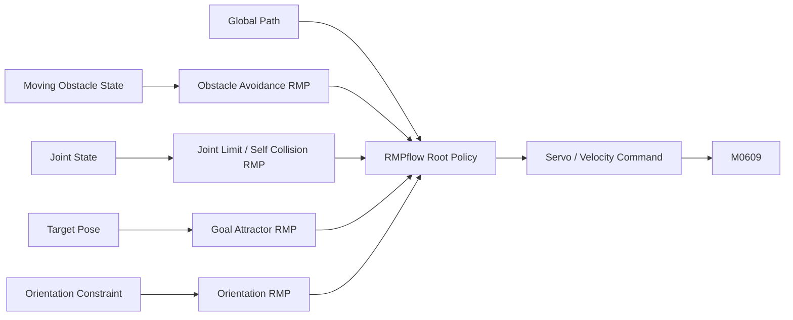

장애물이 경로 안으로 들어오면:

1. RMPflow가 즉시 경로를 국소적으로 변형
2. 경로 변화가 작으면 감속 후 자동 우회
3. 변화가 크거나 새로운 위험이 발생하면 Hold
4. 새로운 전역 경로를 계산
5. AR 화면을 갱신
6. TTS로 재승인 요청

---

### STEP 8. 움직이는 통에 물체 정밀 삽입

1. 이동 통의 위치와 속도를 지속적으로 추적
2. 로봇 도착 예상 시간에 맞춘 미래 목표 위치 계산
3. 통과 일정 거리까지 전역 계획과 RMPflow로 접근
4. 근거리에서는 D455 기반 Visual Servo로 중심 오차 보정
5. 통의 속도와 방향에 맞춰 TCP를 동기화
6. 낮은 속도로 Z축 접근
7. 순응제어로 작은 위치 오차 흡수
8. 물체를 통 내부에 삽입
9. 그리퍼 Open 후 이탈
10. 영상과 깊이로 삽입 성공 확인

예상 목표점:

\[
\mathbf{p}_{intercept}
=
\hat{\mathbf{p}}_{bin}(t+\Delta t_{arrival})
\]

Visual Servo 오차:

\[
\mathbf{e}
=
\mathbf{p}_{target}^{camera}
-
\mathbf{p}_{tcp}^{camera}
\]

\[
\mathbf{v}_{cmd}
=
K_v\mathbf{e}
\]

---

### STEP 9. 움직이는 대상의 뚜껑 체결

고급 태스크에서는 저속 이동 플랫폼 위의 용기 또는 부품을 추적하면서 뚜껑을 체결한다.

1. 뚜껑과 대상의 6D Pose 추정
2. 대상의 이동 속도와 방향 추정
3. 대상과 속도를 맞추는 Follow 모드
4. 뚜껑 중심과 대상 중심 정렬
5. 낮은 Z축 강성으로 접촉 유지
6. TCP Roll 또는 J6 회전
7. 회전각·Z 변위·토크 증가로 체결 완료 판단
8. 조기 과토크 발생 시 반대 회전 후 재정렬

체결 성공 조건 예시:

```text
목표 회전각 도달
OR 회전 저항이 정상 체결 임계값에 도달
AND Z 변위가 예상 체결 깊이 범위 안에 있음
AND 조기 과토크가 발생하지 않음
```

---

## 4. 제스처 및 입력 키 매핑

## 4.1 설계 원칙

- 오른손은 실제 조작, 왼손은 모드 선택, 머리는 자세 보조에 사용
- 제스처를 과도하게 늘리지 않고 시각적으로 구분되는 동작을 선택
- 모드 전환은 약 1초간 유지하는 Dwell Gesture로 오인식 방지
- 로봇 이동 중에는 항상 Dead-man 조건 유지
- Pick, Place, 자동 회피, 삽입, 체결은 TTS 승인 단계를 둠
- 제스처 정지는 소프트웨어 정지이며 실제 비상정지는 하드웨어 E-Stop 사용

---

## 4.2 권장 키 매핑

### 공통 안전 제스처

| 입력 | 기능 | 실행 방식 |
|---|---|---|
| 오른손 손바닥 펼침 | Dead-man 활성화 | 유지 중에만 실시간 이동 |
| 오른손 주먹 | Hold | 즉시 속도 0, 현재 위치 유지 |
| 양손 주먹 | Software Safe Stop | 자동 태스크 및 Servo 정지 |
| 엄지 위 | 승인 | 경로·복구·실행 승인 |
| 엄지 아래 | 거절 | 계획 폐기 또는 이전 단계 복귀 |

### 왼손 모드 선택

| 왼손 제스처 | 모드 | 기능 |
|---|---|---|
| V 사인 | `MOVE` | 오른손 절대 XYZ 위치 추종 |
| 손가락 2개를 모아 세움 | `Z PRECISION` | 오른손 상하 이동만 Z축에 매핑 |
| 손가락 3개 | `ORIENTATION` | 머리 Yaw/Pitch + 오른손 손목 Roll |
| OK 사인 | `GRIPPER` | 오른손 핀치 거리로 그리퍼 너비 제어 |
| 검지 포인팅 | `SELECT` | 객체·목표·장애물 선택 |
| 손바닥 정면 1초 | `OBSTACLE ANCHOR` | 선택 객체를 장애물로 등록 |
| L자 제스처 | `TASK TARGET` | 목표 위치 또는 목적지 지정 |
| 손바닥 아래 방향 | `AUTO APPROACH` | 선택 대상에 자동 접근 후보 생성 |
| 왼손 주먹 1초 | `MODE CLEAR` | 현재 모드 해제 |

---

## 4.3 자동 동작 요청

### Pick 요청

```text
SELECT 모드
→ 객체 선택
→ 오른손 핀치
→ TTS: “선택한 물체를 집을까요?”
→ “응” 또는 엄지 위
```

### 동적 장애물 등록

```text
SELECT 모드
→ 움직이는 객체 선택
→ OBSTACLE ANCHOR 제스처
→ 시스템이 Track ID를 고정
→ 전면·측면 카메라로 지속 추적
```

### 목표 통 지정

```text
SELECT 모드
→ 이동 통 선택
→ TASK TARGET 제스처
→ 시스템이 Place/Insertion Target으로 등록
```

### 직접 목표 위치 지정

```text
TASK TARGET 모드
→ AR 구를 원하는 위치로 이동
→ 핀치
→ 가장 가까운 표면 또는 3D 객체에 Snap
→ 음성 승인 후 저장
```

### 그리퍼 너비 조절

\[
w_{\text{gripper}}
=
w_{\min}
+
\alpha_{\text{pinch}}
(w_{\max}-w_{\min})
\]

---

## 4.4 머리 추종

머리 움직임은 항상 로봇에 연결하지 않는다.  
`ORIENTATION` 모드에서만 다음과 같이 사용한다.

| 머리·손 움직임 | TCP 자세 |
|---|---|
| 머리 좌우 회전 | Yaw |
| 머리 위아래 기울기 | Pitch |
| 오른손 손목 회전 | Roll |

다음 안전 처리를 적용한다.

- Dead zone
- 최대 각도 제한
- 감도 제한
- 회전 속도 제한
- 머리 인식 유실 시 현재 자세 유지

---

## 5. 손 좌표와 로봇 목표 좌표 생성

## 5.1 입력 특징

MediaPipe 기반으로 다음 값을 추출한다.

- 손바닥 중심
- 손바닥 법선벡터
- 손목 방향
- 엄지·검지 거리
- 손바닥 픽셀 폭
- 손가락 개수와 제스처 클래스
- 얼굴의 Yaw, Pitch, Roll

---

## 5.2 절대 위치 매핑

사용자의 가상 조종 공간을 로봇의 안전 작업공간에 매핑한다.

\[
\mathbf{p}_{robot}
=
\operatorname{clamp}
\left(
\mathbf{S}\mathbf{p}_{hand}
+
\mathbf{b}
\right)
\]

- \(\mathbf{S}\): 축별 Scale
- \(\mathbf{b}\): 원점 Offset
- `clamp`: 로봇 작업영역 제한

### 단안 웹캠 Z 추정

손바닥 폭과 카메라 거리의 역비례 관계를 이용한다.

\[
d \approx \frac{k}{w_{palm}}
\]

사용자별 가까운 지점과 먼 지점에서 캘리브레이션한다.

---

## 5.3 스무딩

- EMA
- One Euro Filter
- Outlier 제거
- 최대 목표 변화량 제한
- 속도·가속도 제한
- 손 유실 Timeout
- Dead zone

```text
입력 스무딩
→ 손 떨림과 좌표 노이즈 감소

Motion Safety
→ 충돌, 관절 한계, 특이점, 속도 제한 처리
```

---

## 5.4 실시간 추종 방식

손 위치는 절대 목표로 사용하지만 카메라 주기마다 `movej()`를 반복 전송하지 않는다.

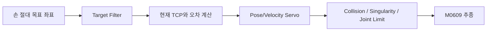

\[
\mathbf{v}_{target}
=
K_p(\mathbf{p}_{target}-\mathbf{p}_{current})
\]

큰 위치 오차에서는 최대 속도 제한 내에서 빠르게 이동하고 목표에 가까워질수록 감속한다.

---

## 6. 멀티카메라 3D 인지 구조

## 6.1 카메라 좌표계

```text
robot_base
├── front_camera
├── side_camera
└── robot_flange
      └── D455
```

필요한 캘리브레이션:

- 전면 카메라 내부 파라미터
- 측면 카메라 내부 파라미터
- 전면 ↔ 로봇 베이스 Extrinsic
- 측면 ↔ 로봇 베이스 Extrinsic
- D455 ↔ Flange Hand-Eye
- 카메라 Timestamp 동기화

---

## 6.2 객체 3D 위치 계산

### 전면·측면 카메라

- 동일 객체를 Cross-camera Association
- 각 카메라의 관측 Ray를 이용한 Triangulation
- 바닥 평면 또는 알려진 작업대 높이와 교차
- 객체 크기와 Bounding Box를 함께 사용하여 보정

### D455

- 선택 객체 중심의 Depth 사용
- Point Cloud에서 객체 영역 분리
- 근거리 3D Bounding Box 및 Pose 계산

### 최종 융합

\[
\mathbf{p}_{fused}
=
\frac{
\sum_i w_i\mathbf{p}_i
}{
\sum_i w_i
}
\]

카메라별 신뢰도, Depth 품질, 가림 정도에 따라 가중치를 설정한다.

---

## 6.3 동적 장애물 예측

- Kalman Filter
- Constant Velocity Model
- 필요 시 Optical Flow
- Track ID 유지
- 미래 위치 기반 Safety Margin 확장

객체 위치 신뢰도가 낮거나 속도가 빠를수록 장애물 부피를 더 크게 잡는다.

```text
높은 신뢰도 + 저속
→ 기본 안전여유

낮은 신뢰도 또는 고속
→ Collision Object 확대
```

---

## 7. 실시간 AR 경로 생성

실시간 경로는 세 계층으로 분리한다.

## 7.1 빠른 예측 경로

손 목표가 움직일 때 즉시 표시하는 경량 경로다.

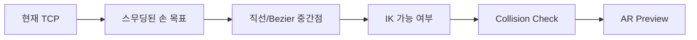

권장 목표 주기:

- 손 추적: 20~30 Hz
- AR 커서: 30 Hz
- Preview Path: 10~20 Hz
- 동적 객체 상태 갱신: 카메라 FPS에 맞춤

---

## 7.2 전역 경로계획

목표 또는 Scene이 의미 있게 바뀌었을 때 실행한다.

- MoveIt 2 Planning Scene
- OMPL RRTConnect / RRT*
- 필요 시 CHOMP, STOMP, TrajOpt 비교
- 경로 후보 생성 및 Cost Ranking
- 시간 파라미터화
- 미래 TCP 및 링크 자세 계산

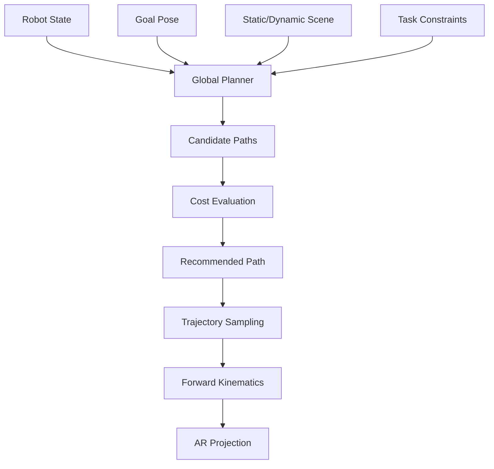

---

## 7.3 RMPflow 지역 회피

전역 경로의 다음 Reference Point를 목표로 사용하면서, 동적 장애물과 관절 상태를 반영해 로봇 명령을 실시간 수정한다.

- 장애물 반발
- 목표 흡인
- 관절 한계 회피
- 자기충돌 회피
- 자세 유지
- 감쇠

RMPflow 적용이 어려운 경우 다음 대안을 비교할 수 있다.

- MoveIt Servo Collision Scaling
- CHOMP/STOMP 재최적화
- Model Predictive Control
- Velocity Obstacle 기반 제한
- Dynamic Potential Field
- 짧은 Horizon의 반복 Replanning

---

## 7.4 AR 경로 렌더링

MoveIt 또는 RMPflow가 생성한 3D TCP 경로를 태스크 카메라 영상에 투영한다.

\[
\begin{bmatrix}
u\\v\\1
\end{bmatrix}
\sim
\mathbf{K}
\begin{bmatrix}
X_c/Z_c\\
Y_c/Z_c\\
1
\end{bmatrix}
\]

표현 요소:

| AR 요소 | 표현 |
|---|---|
| 현재 TCP | 파란 구 |
| 가상 손 목표 | 라임 구 |
| 추천 경로 | 라임 실선 |
| 대체 경로 | 회색 점선 |
| 실제 지나온 경로 | 파란 실선 |
| 현재 장애물 | 빨간 Box |
| 미래 장애물 영역 | 빨간 반투명 Volume |
| 이동 목표 미래 위치 | 라임 원과 이동 화살표 |
| 예상 그리퍼 자세 | 반투명 Ghost Gripper |
| 작업 가능 영역 | 바닥 Polygon |
| 음성 질문 | 하단 대화창 |

---

## 7.5 실행 중 재계획

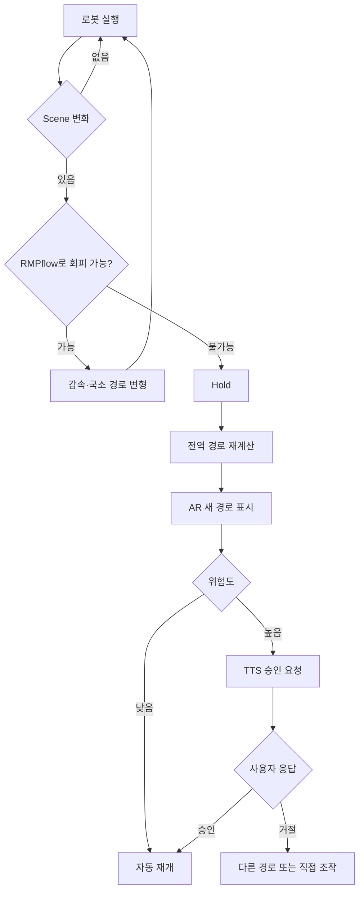

---

## 8. 음성 인터페이스

## 8.1 음성의 역할

음성은 저수준 연속 이동보다 다음 역할에 사용한다.

- 경로 승인·거절
- 작업 실행·취소
- 대상·목적지·장애물 지정
- 접근 방향과 안전 제약 추가
- 현재 상태 질문
- 실패 원인 질문
- 복구 행동 승인
- 다음 행동 추천 확인

---

## 8.2 대화 예시

### 경로 승인

시스템:

> “이동 장애물을 고려하면 왼쪽 우회 경로의 성공 확률이 가장 높습니다. 실행할까요?”

작업자:

> “응. 실행해.”

### 동적 장애물 지정

작업자:

> “방금 선택한 검은 블록을 움직이는 장애물로 등록해.”

시스템:

> “동적 장애물로 등록했습니다. 전면과 측면 카메라로 추적을 시작합니다.”

### 목표 확인

작업자:

> “이 물체를 저 통 안에 넣을 거야.”

시스템:

> “파란색 이동 통을 목표로 설정할까요?”

### 상태 질문

작업자:

> “왜 멈췄어?”

시스템:

> “이동 장애물이 기존 경로 안으로 진입했고, 0.8초 뒤 예상 안전거리가 4.1센티미터로 감소하여 정지했습니다.”

### 실패 복구

시스템:

> “통의 속도 예측 오차로 삽입 중심이 19밀리미터 벗어났습니다. 속도를 다시 측정하고 Visual Servo로 재접근할까요?”

작업자:

> “응. 더 천천히 해.”

---

## 8.3 음성 처리 흐름

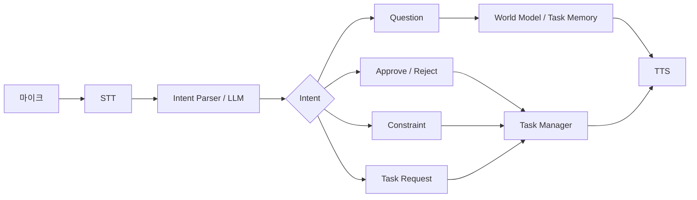

LLM은 직접 관절값을 생성하지 않고 허용된 Skill API만 선택한다.

```text
select_object()
set_dynamic_obstacle()
set_target()
preview_path()
approve_path()
approach()
grasp()
transport()
insert_moving_target()
close_lid()
pause()
retry()
explain_failure()
```

---

## 9. 실패 감지와 원인 역추적

## 9.1 실패 유형

| 구분 | 실패 예시 |
|---|---|
| 인식 실패 | 객체 오인식, Track ID 변경, Depth 누락 |
| 3D 융합 실패 | 전면·측면 객체 매칭 오류, 좌표 변환 오차 |
| 경로 실패 | 충돌, 특이점, 관절 제한, 동적 예측 오차 |
| 파지 실패 | 중심 오차, 너비 부족, 힘 부족, 미끄러짐 |
| 운반 실패 | 물체 낙하, 급가속, 장애물 접근 |
| 이동 목표 추적 실패 | 속도 추정 오차, Target Lost |
| 삽입 실패 | 통 중심 오차, 가장자리 걸림, 타이밍 불일치 |
| 체결 실패 | 중심 불일치, 나사산 비틀림, 조기 과토크 |
| 음성·승인 실패 | 모호한 지시, 잘못된 승인 상태 |

---

## 9.2 기록 데이터

```yaml
timestamp:
task_id:
subtask:
operator_command:
gesture_mode:

robot:
  joint_position:
  tcp_pose:
  tcp_velocity:
  external_force:
  external_torque:

gripper:
  target_width:
  actual_width:
  target_force:

vision:
  front_frame:
  side_frame:
  d455_rgb:
  d455_depth:
  target_pose:
  target_velocity:
  obstacle_states:
  detection_confidence:

planning:
  global_path:
  local_rmp_command:
  path_cost:
  minimum_clearance:
  singularity_score:
  replanning_count:

result:
  success:
  failure_type:
  failure_confidence:
  human_correction:
  retry_result:
```

---

## 9.3 실패 분석 구조

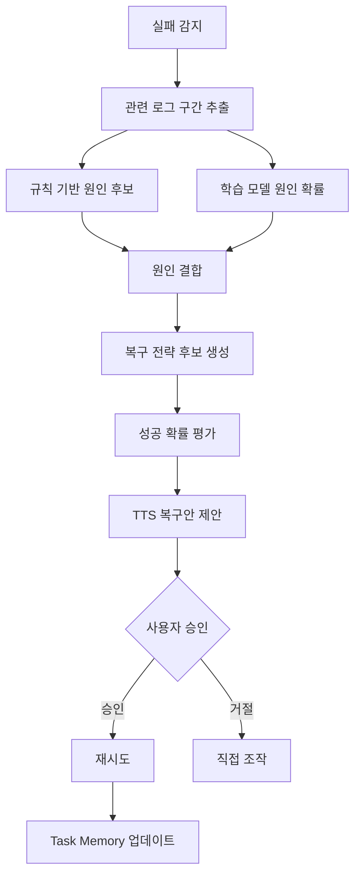

---

## 9.4 규칙 기반 예시

```text
그리퍼가 거의 완전히 닫혔고
실제 너비가 예상 물체 너비보다 작음
→ 미파지 가능성

이동 중 하중이 급격히 감소하고
객체 Track이 그리퍼에서 분리됨
→ 물체 낙하 가능성

삽입 중 Z 이동이 정체되고
XY 측면 힘이 증가함
→ 입구 가장자리 걸림 가능성

이동 통의 예측 위치와 실제 위치 오차가 임계값 초과
→ 속도 추정 또는 시간 동기화 오류

체결 초기에 회전 토크가 급상승하고
Z 변위가 거의 없음
→ 나사산 비정상 체결 가능성
```

---

## 9.5 복구 전략

| 실패 원인 | 추천 복구 |
|---|---|
| 파지 중심 오차 | D455 재스캔 후 중심 재정렬 |
| 파지력 부족 | 그리퍼 힘·너비 재설정 |
| 물체 미끄러짐 | 이동 가속도 감소, 자세 유지 |
| 동적 장애물 접근 | RMP Safety Margin 확대 후 재계획 |
| Target Lost | Hold 후 전면·측면 카메라 재탐색 |
| 이동 목표 예측 오차 | 속도 재추정 후 Intercept Time 재계산 |
| 삽입 걸림 | 순응 강성 조정, 나선형 재탐색 |
| 체결 조기 과토크 | 반대 회전 후 중심 재정렬 |
| 카메라 좌표 불일치 | Calibration 상태 확인 후 태스크 중지 |

---

## 10. 작업 기억과 다음 행동 추천

## 10.1 목적

과거 작업의 성공·실패·사용자 수정 패턴을 이용해 현재 상황에서 다음 행동을 먼저 제안한다.

예:

```text
현재 상태:
- 대상 파지 완료
- 이동 통 추적 중
- 오른쪽 동적 장애물 접근
- 과거 직선 접근 실패 경험

추천:
1. 왼쪽 우회 후 속도 동기화 72%
2. Hold 후 통 재스캔 19%
3. 위쪽 우회 9%
```

---

## 10.2 구현 단계

### 1단계: 빈도 기반

\[
P(a_{t+1}|s_t)
=
\frac{\text{상태 }s_t\text{ 이후 행동 }a\text{ 발생 횟수}}
{\text{상태 }s_t\text{ 발생 횟수}}
\]

### 2단계: 조건부 모델

입력:

- 현재 작업 단계
- 대상 클래스
- 대상·장애물 위치와 속도
- 접근 방향
- 현재 로봇 자세
- 과거 실패 유형
- 사용자의 수정 행동

출력:

- 다음 Skill 확률
- 예상 성공률
- 추천 경로 유형
- 추천 속도·그리퍼·순응 파라미터

### 3단계: 순차 모델

데이터가 충분히 쌓이면 다음 모델을 검토한다.

- Markov Model
- XGBoost
- LSTM
- Transformer
- Behavior Cloning
- Learning from Demonstration

AI는 행동을 자동으로 실행하기보다 **확률과 이유를 설명하고 승인받아 실행**하는 구조를 기본으로 한다.

---

## 11. 시스템 아키텍처

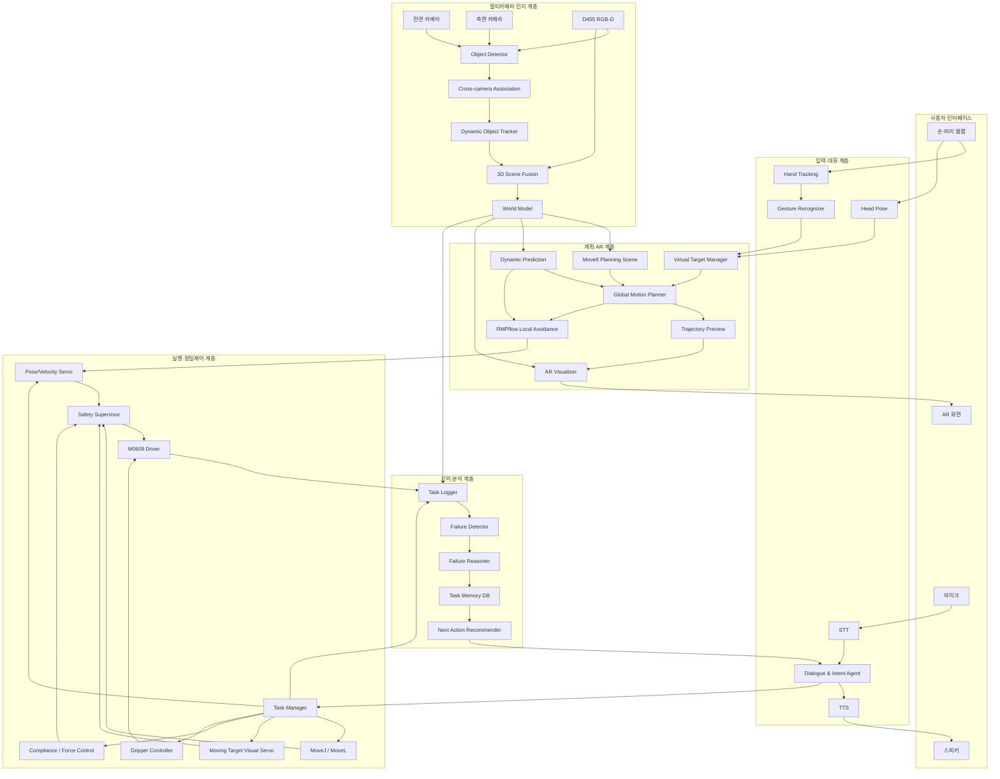

---

## 12. 필요한 하드웨어

| 장비 | 용도 |
|---|---|
| Doosan M0609 | 6축 정밀작업 로봇 |
| RG2 또는 장착 그리퍼 | 물체·뚜껑 파지 |
| Intel RealSense D455 | 손목 RGB-D 정밀 인식 |
| 전면 태스크 카메라 | 작업공간 전면 관찰 및 AR 기준 |
| 측면 태스크 카메라 | 깊이·높이·가림 보완 |
| 사용자 웹캠 | 손·머리 추적 |
| 마이크 | STT와 명령 입력 |
| 스피커 | TTS 질문·상태 안내 |
| 제어 PC | ROS 2, MoveIt 2, 로봇 제어 |
| 비전·AI PC | 객체 인식, 카메라 융합, Agent |
| 네트워크 스위치 | 카메라·PC·로봇 통신 |
| 물리적 E-Stop | 실제 비상정지 |
| 일반 작업 물체 | 파지 대상 |
| 이동 통·이동 트레이 | 동적 Place 목표 |
| 정적·동적 장애물 | 회피 검증 |
| 선형 스테이지·컨베이어 | 목표·장애물 이동 구현 |
| 체결용 대형 뚜껑 | 순응·회전 데모 |
| ArUco/AprilTag | 카메라·로봇 좌표 캘리브레이션 |

---

## 13. 소프트웨어 및 기술 스택

| 영역 | 기술 |
|---|---|
| 운영체제 | Ubuntu 22.04 |
| 미들웨어 | ROS 2 Humble |
| 로봇 제어 | Doosan ROS 2 Driver |
| 전역 경로계획 | MoveIt 2, OMPL |
| 지역 회피 | RMPflow 또는 MoveIt Servo Collision Scaling |
| 실시간 추종 | MoveIt Servo / Doosan 속도 제어 |
| 정밀 접근 | Visual Servo |
| 접촉 작업 | Compliance / Force Control |
| 손 인식 | MediaPipe Hands |
| 머리 인식 | MediaPipe Face Mesh / Head Pose |
| 객체 인식 | YOLO 계열 |
| 범용 객체 선택 | Open-vocabulary Detection 확장 |
| 객체 추적 | ByteTrack / SORT 계열 / Kalman Filter |
| RGB-D | RealSense SDK, Point Cloud |
| 영상 처리 | OpenCV |
| 좌표계 | ROS 2 TF2 |
| 카메라 보정 | Stereo / Multi-camera / Hand-Eye Calibration |
| AR 렌더링 | OpenCV Overlay 또는 Web UI |
| 음성 인식 | Whisper 계열 또는 STT |
| 음성 합성 | TTS 엔진 |
| Agent | LLM + 제한된 Robot Skill API |
| DB | SQLite / PostgreSQL |
| 실패 분석 | 규칙 기반 + XGBoost/SVM/신경망 확장 |

---

## 14. ROS 2 노드 구조

### 14.1 사용자 입력 노드

| 노드 | 역할 | 주요 출력 |
|---|---|---|
| `/operator_hand_node` | 손 랜드마크·자세 추출 | `/operator/hand_pose`, `/operator/pinch` |
| `/operator_head_node` | 머리 Yaw/Pitch 추정 | `/operator/head_pose` |
| `/gesture_recognizer_node` | 제스처·Dwell 상태 판정 | `/operator/gesture`, `/operator/mode_request` |
| `/voice_stt_node` | 음성을 텍스트로 변환 | `/voice/utterance` |
| `/dialogue_agent_node` | 질문·승인·명령 해석 | `/agent/intent`, `/agent/response` |
| `/tts_node` | TTS 출력 | `/voice/tts_audio` |

### 14.2 멀티카메라 인지 노드

| 노드 | 역할 | 주요 출력 |
|---|---|---|
| `/front_camera_node` | 전면 영상 입력 | `/front_camera/image_raw` |
| `/side_camera_node` | 측면 영상 입력 | `/side_camera/image_raw` |
| `/d455_camera` | RGB·Depth·Point Cloud | `/d455/color/image_raw`, `/d455/depth/image_rect_raw` |
| `/multi_camera_sync_node` | 영상과 TF 시간 동기화 | `/perception/synced_frames` |
| `/object_detector_node` | 객체 검출 | `/perception/detections_2d` |
| `/cross_camera_association_node` | 두 카메라 객체 ID 연결 | `/perception/matched_objects` |
| `/dynamic_object_tracker_node` | 위치·속도·미래 Pose 추정 | `/perception/tracked_objects` |
| `/depth_pose_estimator_node` | D455 기반 3D Pose | `/perception/objects_3d` |
| `/scene_fusion_node` | 공통 World Model 구성 | `/scene/world_objects` |
| `/planning_scene_bridge_node` | Collision Object 변환 | `/planning_scene` |
| `/camera_calibration_node` | Extrinsic·Hand-Eye 관리 | `/tf`, `/tf_static` |

### 14.3 계획·제어 노드

| 노드 | 역할 | 주요 출력 |
|---|---|---|
| `/intent_manager_node` | 모드·목표·제약 관리 | `/control/mode`, `/task/goal` |
| `/virtual_target_node` | 손 좌표를 TCP 목표로 변환 | `/control/target_pose` |
| `/trajectory_preview_node` | 빠른 AR 예상 경로 생성 | `/planning/preview_path` |
| `/global_motion_planner_node` | 전역 후보 경로 생성 | `/planning/robot_trajectory` |
| `/dynamic_prediction_node` | 동적 객체 미래 위치 계산 | `/planning/predicted_objects` |
| `/rmpflow_controller_node` | 실시간 지역 회피 | `/control/rmp_command` |
| `/ar_visualizer_node` | AR 영상 합성 | `/ar/display_image` |
| `/task_manager_node` | Pick·Transport·Insert·Seal 상태 머신 | Action Server |
| `/servo_controller_node` | Pose/Velocity 실시간 추종 | 로봇 속도 명령 |
| `/moving_target_servo_node` | 이동 목표 Visual Servo | `/control/tracking_command` |
| `/motion_executor_node` | MoveJ·MoveL 실행 | Doosan 명령 |
| `/compliance_controller_node` | 순응·힘 제어 | Doosan Compliance 명령 |
| `/gripper_controller_node` | 그리퍼 너비·힘 제어 | 그리퍼 명령 |
| `/safety_supervisor_node` | 충돌·특이점·Timeout 감시 | `/safety/state` |

### 14.4 기록·학습 노드

| 노드 | 역할 | 주요 출력 |
|---|---|---|
| `/task_logger_node` | 센서·명령·결과 저장 | DB |
| `/failure_detector_node` | 성공·실패 판정 | `/failure/event` |
| `/failure_reasoner_node` | 실패 원인 확률 계산 | `/failure/diagnosis` |
| `/recovery_planner_node` | 복구 행동 후보 생성 | `/recovery/options` |
| `/task_memory_node` | 과거 작업 저장·검색 | `/memory/query_result` |
| `/next_action_recommender_node` | 다음 행동 확률 추천 | `/recommendation/actions` |

---

## 15. 권장 ROS 2 토픽·메시지

```text
/operator/hand_pose                  geometry_msgs/PoseStamped
/operator/head_pose                  geometry_msgs/Vector3Stamped
/operator/gesture                    custom_msgs/GestureState
/operator/control_enable             std_msgs/Bool

/control/mode                        custom_msgs/ControlMode
/control/target_pose                 geometry_msgs/PoseStamped
/control/gripper_width               std_msgs/Float64
/control/rmp_command                 geometry_msgs/TwistStamped

/voice/utterance                     std_msgs/String
/agent/intent                        custom_msgs/RobotIntent
/agent/response                      std_msgs/String

/perception/detections_2d            vision_msgs/Detection2DArray
/perception/matched_objects          custom_msgs/MatchedObjectArray
/perception/tracked_objects          custom_msgs/TrackedObjectArray
/perception/objects_3d               vision_msgs/Detection3DArray
/scene/world_objects                 custom_msgs/SceneObjectArray

/planning/predicted_objects          custom_msgs/PredictedObjectArray
/planning/preview_path               nav_msgs/Path
/planning/robot_trajectory           moveit_msgs/RobotTrajectory
/planning/path_metrics               custom_msgs/PathMetrics

/task/state                          custom_msgs/TaskState
/safety/state                        custom_msgs/SafetyState
/failure/event                       custom_msgs/FailureEvent
/failure/diagnosis                   custom_msgs/FailureDiagnosis
/recommendation/actions              custom_msgs/ActionRecommendationArray
```

---

## 16. Task Manager 상태 머신

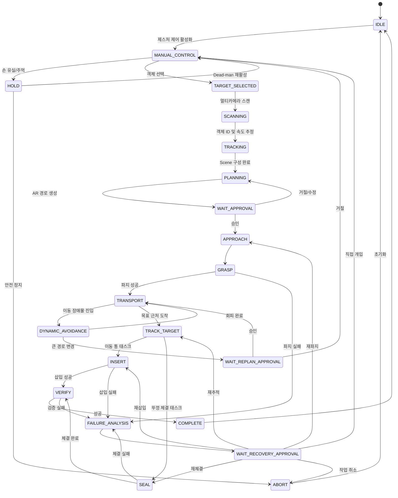

---

## 17. 제어 방식 역할 분담

| 방식 | 사용 구간 |
|---|---|
| MoveJ | 홈 복귀, 스캔 자세 전환, 큰 관절 공간 이동 |
| MoveL | 파지·삽입 직전의 직선 접근과 이탈 |
| Servo / 속도 제어 | 제스처 절대 목표 실시간 추종 |
| MoveIt Global Planning | 정적 장애물을 고려한 전체 우회 경로 |
| RMPflow | 움직이는 장애물에 대한 실시간 지역 회피 |
| Visual Servo | 움직이는 통·뚜껑 중심 추적과 정렬 |
| 순응제어 | 삽입, 접촉 유지, 뚜껑 체결 |
| 그리퍼 위치·힘 제어 | 물체 파지와 안정적인 유지 |

---

## 18. 안전 설계

- 물리적 E-Stop 유지
- 손 유실 Timeout 시 Hold
- 제어 메시지 Timeout 시 속도 0
- TCP 최대 속도·가속도 제한
- 작업영역 제한
- 관절 위치·속도 제한
- 자체충돌 검사
- 환경 충돌 검사
- Attached Object 포함 충돌 검사
- 특이점 접근 감속
- 동적 장애물 추적 신뢰도 저하 시 감속·정지
- 멀티카메라 Timestamp 불일치 감시
- 카메라 Scene 갱신 중단 시 Hold
- 이동 목표 속도 상한 설정
- 높은 위험의 경로 변경은 음성 승인 후 실행
- 순응제어 힘·토크 한계 설정
- 실제 로봇 전 시뮬레이션·RViz 검증

---

## 19. 개발 단계

## Phase 1. 제스처 기반 원격조작

- MediaPipe Hands 및 Head Pose
- 손 절대 XYZ 목표 생성
- 제스처 모드 전환
- 그리퍼 너비 연동
- 손 유실 정지
- M0609 Servo 추종

## Phase 2. AR 시각화

- 전면 카메라 캘리브레이션
- TF 기반 3D→2D 투영
- 가상 손·TCP·목표 표시
- 모드·상태 HUD
- 빠른 예상 경로 표시

## Phase 3. 전면·측면 멀티카메라 3D 추적

- 두 카메라 내부·외부 보정
- 객체 검출과 Cross-camera Association
- Triangulation 또는 평면 교차
- Kalman 기반 위치·속도 추정
- 동적 장애물 Anchor
- D455 정밀 Pose 보완

## Phase 4. AR 후보 경로와 음성 승인

- Planning Scene 생성
- 복수 전역 경로 생성
- 경로 Cost 평가
- AR 추천·대체 경로 표시
- TTS 질문과 승인
- 실행 중 전역 재계획

## Phase 5. RMPflow 동적 회피

- Goal Attractor
- Obstacle Avoidance
- Joint Limit Avoidance
- Orientation 유지
- Global Path Reference
- MoveIt Servo 또는 Doosan 속도 명령 연동

## Phase 6. 이동 목표 정밀 태스크

- 움직이는 통 추적
- 미래 목표 위치 예측
- Visual Servo
- 순응제어 삽입
- 저속 이동 대상의 뚜껑 체결

## Phase 7. 실패 분석과 작업 기억

- Task Log DB
- 규칙 기반 실패 분석
- 복구 행동 추천
- 과거 성공률 기반 다음 행동 제안
- 학습 모델 적용

---

## 20. MVP와 확장 범위

## 20.1 반드시 구현할 MVP

- 손 제스처 기반 M0609 TCP 이동
- 제스처 모드 전환과 그리퍼 너비 제어
- 전면 태스크 카메라 AR 커서
- 전면·측면 카메라로 한 개의 동적 장애물 3D 추적
- 장애물 Anchor 지정
- 정적 전역 경로 생성
- 경로 AR 시각화와 음성 승인
- 실행 중 장애물 접근 시 Hold·재계획
- 물체 파지
- 저속 이동 통에 물체 Place
- 규칙 기반 실패 분석과 로그 저장

## 20.2 고급 목표

- 다중 동적 장애물 추적
- RMPflow 실시간 국소 회피
- 이동 통에 정밀 삽입
- Visual Servo 기반 속도 동기화
- 뚜껑 체결과 과토크 감지
- 다음 행동 확률 추천
- 경로 선택 이유 자연어 설명
- 능동 시점 선택

## 20.3 연구 확장

- 작업 스킬 자동 분할
- Learning from Demonstration
- Imitation Learning
- VLA 기반 조작 정책
- 사용자별 제스처 감도 학습
- 불확실성 기반 안전거리 자동 조절
- 디지털 트윈 선검증
- MPC와 RMPflow 성능 비교

---

## 21. 성능 평가 지표

| 평가 항목 | 측정 방법 |
|---|---|
| 제스처 인식률 | 정답 제스처 대비 정확도 |
| 손 목표 추종 오차 | 목표 TCP와 실제 TCP 거리 |
| AR 투영 오차 | 실제 위치와 AR 표시 픽셀 오차 |
| 멀티카메라 3D 오차 | 기준 좌표 대비 객체 위치 오차 |
| 동적 속도 추정 오차 | 실제 이동 속도 대비 추정 오차 |
| Track 유지율 | 프레임 간 객체 ID 유지 비율 |
| Preview 갱신 시간 | 손·장애물 변화부터 AR 반영까지 |
| 전역 경로 생성 시간 | 목표 확정부터 경로 출력까지 |
| 최소 장애물 거리 | 실행 궤적의 최소 Clearance |
| 재계획 성공률 | 경로 차단 후 성공적인 새 경로 비율 |
| 파지 성공률 | 성공 파지/총 시도 |
| 이동 통 Place 성공률 | 통 내부 정상 배치/총 시도 |
| 정밀 삽입 성공률 | 삽입 완료/총 시도 |
| 뚜껑 체결 성공률 | 정상 체결/총 시도 |
| 실패 원인 정확도 | 실제 라벨과 진단 결과 비교 |
| 복구 성공률 | 재시도 후 성공 비율 |
| 행동 추천 적중률 | 추천 행동이 실제 선택된 비율 |
| 사용자 개입 횟수 | 태스크당 수동 수정 횟수 |

---

## 22. 발표용 핵심 메시지

### 문제

기존 산업용 로봇은 고정된 위치와 반복 공정에는 강하지만, 사람·물체·목적지가 움직이고 작업 방식이 계속 바뀌는 비정형 환경에서는 빠르게 대응하기 어렵다.

### 해결

작업자는 손·머리 제스처와 음성으로 목표·장애물·모드를 지정하고, 로봇은 전면·측면·손목 카메라로 환경을 3D화하여 전역 경로와 실시간 회피 경로를 계산한다. 경로는 AR로 먼저 시각화되며, 사용자의 승인을 받은 뒤 정밀 작업을 수행한다.

### 차별점

1. 손의 절대 위치를 이용한 **제스처 기반 실시간 로봇 이동**
2. 전면·측면·손목 카메라를 결합한 **동적 3D World Model**
3. MoveIt 전역계획과 RMPflow를 결합한 **동적 장애물 회피**
4. 로봇의 미래 이동을 미리 보여주는 **실시간 AR 경로 시각화**
5. 음성 질문·승인을 결합한 **공유자율 인터페이스**
6. Visual Servo와 순응제어를 이용한 **이동 목표 정밀 작업**
7. 실패 원인을 역추적하고 복구안을 제안하는 **Failure-Aware System**
8. 작업 이력을 기반으로 다음 행동을 먼저 제안하는 **Predictive Robot Agent**

---

## 23. 최종 한 줄 요약

> **본 시스템은 M0609, 손·머리 제스처, 음성 대화, 전면·측면·손목 멀티카메라 3D 인식, MoveIt·RMPflow 기반 경로계획, 실시간 AR 시각화, Visual Servo, 순응제어와 작업 기억을 결합하여 변화하는 작업환경에서 다양한 정밀 태스크를 사람과 함께 수행하는 DUM-E형 범용 로봇을 구현한다.**
